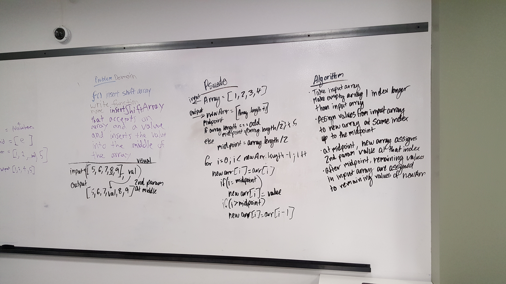

# Insert and shift middle index of array
Inserts a value into the middle of an array

## Challenge
Add a value into the middle of an array

## Approach & Efficiency
We took the approach where we take the array and create a copy + 1 to it, and copied for each element in the array into the new array except the middle index, where the new value is assigned at that index.

## Travis
* [Travis tests] (https://travis-ci.com/shiratap/data-structures-and-algorithms)

## Solution

