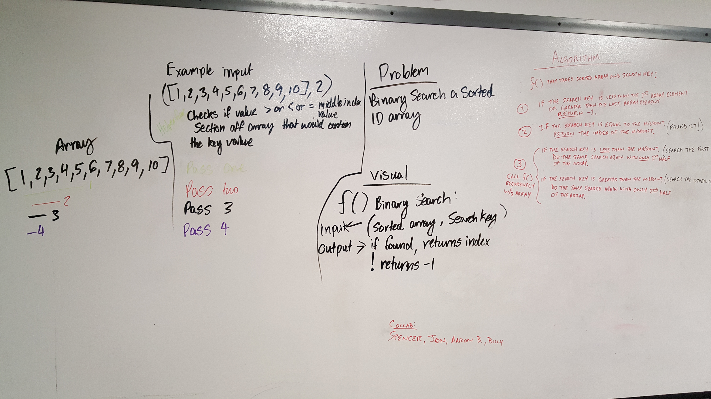

# Binary Search
Finds index of any input value, if not returns -1

## Challenge
Binary search, figure out if and where the value inputted into the second paramater is in the first parameter array. The return value is the index of that value in the array

## Approach & Efficiency
The effeciency of the code is based proportional to the array list, but like O(arraylist/n);

## Solution
