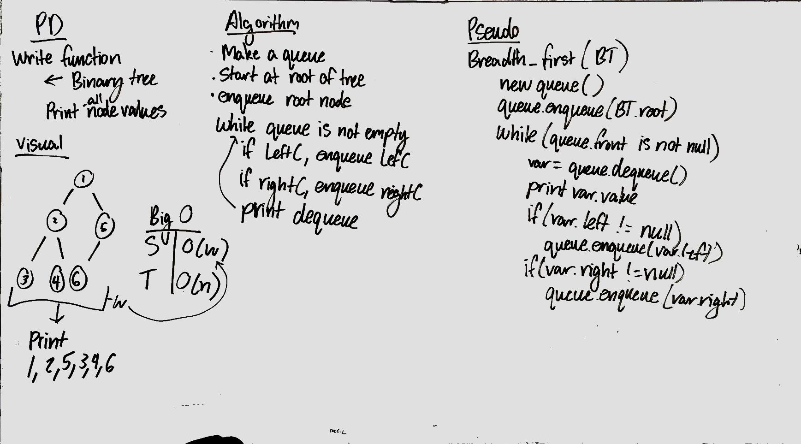

# Breadth-first

## Travis

## Challenge
Add a method that prints the values of a tree in a breadth traversal

## Approach & Efficiency
* create a queue
* enqueue the queue with the root of the tree
* while loop until the queue is empty
  1. dequeue the stack and print value
  2. dequeued value has left child, enqueue left child
  3. dequeued value has right child, enqueue right child

## Solution
