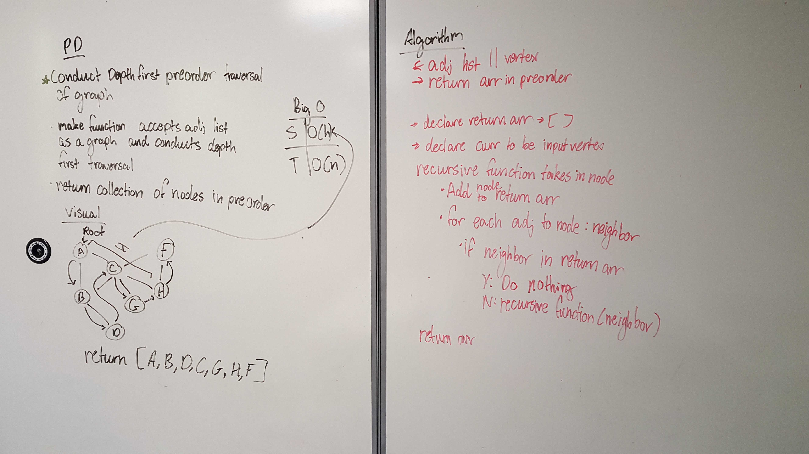

# Depth First Traversal

## Challenge
Given an adj list, return an arr that is in a depth first order

## Approach & Efficiency
Big O
  - Space: O(h) => how high the callstack is
  - Time: O(n) => Needs to hit every node

## Solution

