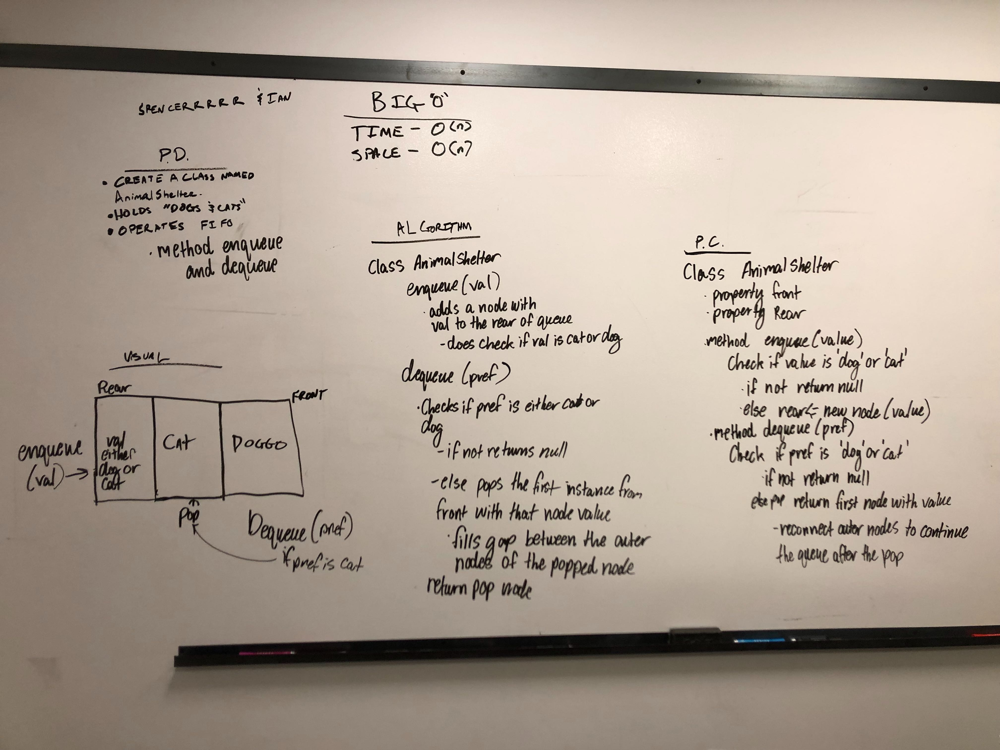

# First-in, First out Animal Shelter.
Create a Animal Shelter that operates FIFO

## Travis

## Challenge
Build a class with Enqueue and Dequeue methods. Enqueue puts more cats and dogs in the queue, dequeue finds an animal and returns the node with that animal value

## Approach & Efficiency

## Solution

