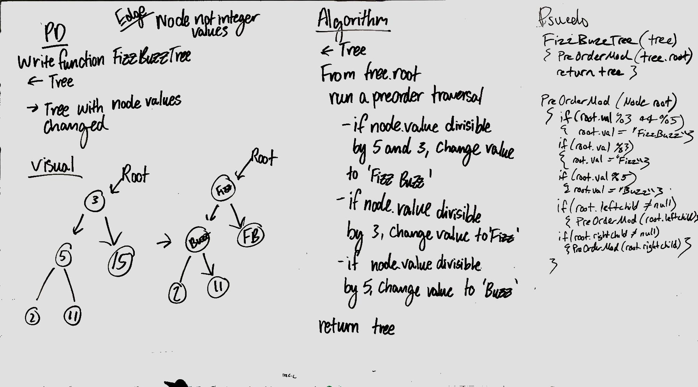

# FizzBuzzTree

## Travis

## Challenge
Change all values that are divisible by both 5 and 3 to FizzBuzz, 5 to Buzz, 3 to Fizz

## Approach & Efficiency
Traverse the list from the root with a preorder traversal, compare if it's a target value, make the switch to that value

## Solution
