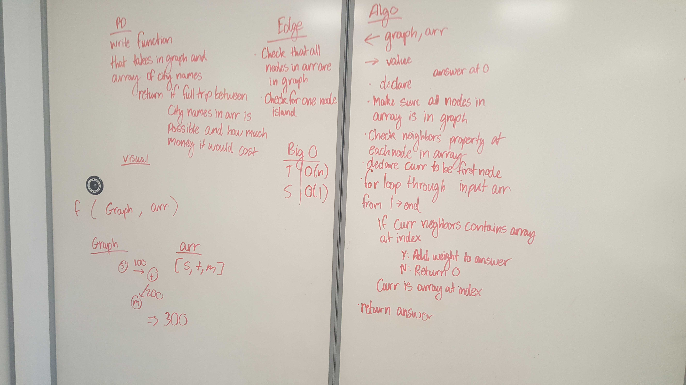

# Find Edges

## Challenge
Calculate the price(weight) between cities(nodes) in an array. If an edge doesn't exist between current and proceeding index

## Approach & Efficiency
<!-- What approach did you take? Why? What is the Big O space/time for this approach? -->

## Solution
