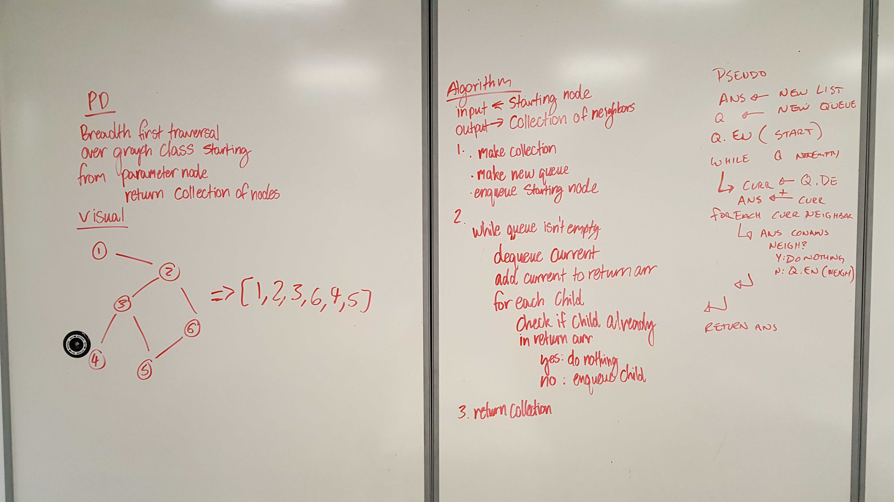

# Graphs

## Challenge
Make a graph data structure

## API
* AddNode(value)
  * Adds a node with a value to the graph
* AddEdge(node1,node2,weight)
  * Connects the two existing nodes with the weight
* GetNodes()
  * Returns all nodes in the graph
* GetNeighbors(node)
  * Gets all neighbors of the node
* Size()
  * Returns how many nodes are in the graph
* breadthFirst(node)
  * Returns array of all chained neighboring nodes

# Breadth-First Traversal of a Graph

## Challenge
Return a collection of all the neighboring nodes from a node, with breadth first traversal

## Approach & Efficiency
* Use a stack and enqueue the node passed in
* Pop from stack
  * If popped node neighbor is already in return array
    * Y: Do nothing
    * N: Enqueue neighbor
* Return array

#### Big O
* Time: O(n)
* Space: O(n)

## Solution
