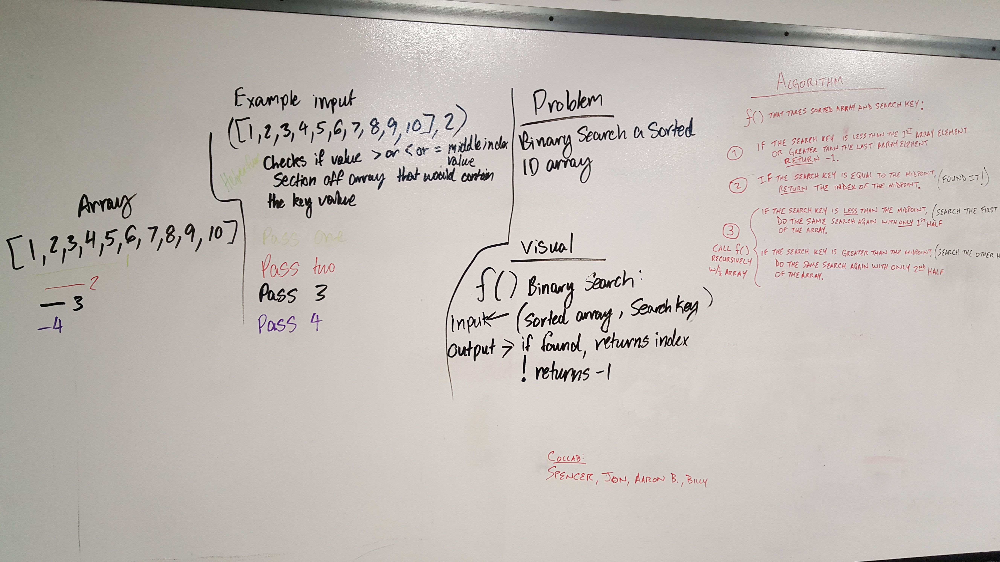

# Linked List Insertions
Linked List class with nodes

## Challenge
Added: 
append(value) => adds node at the end of the list
insertBefore(value, newValue) => adds node with newValue before a node with value
insertAfter(value, newValue) => adds node with newValue after a node with value

## Approach & Efficiency
append => find end of list, point last node to new node with value
insertBefore => find node with value = paramater1, insert a node before that one
insertAfter => find node with value = paramater1, insert a node after that one

## Solution
