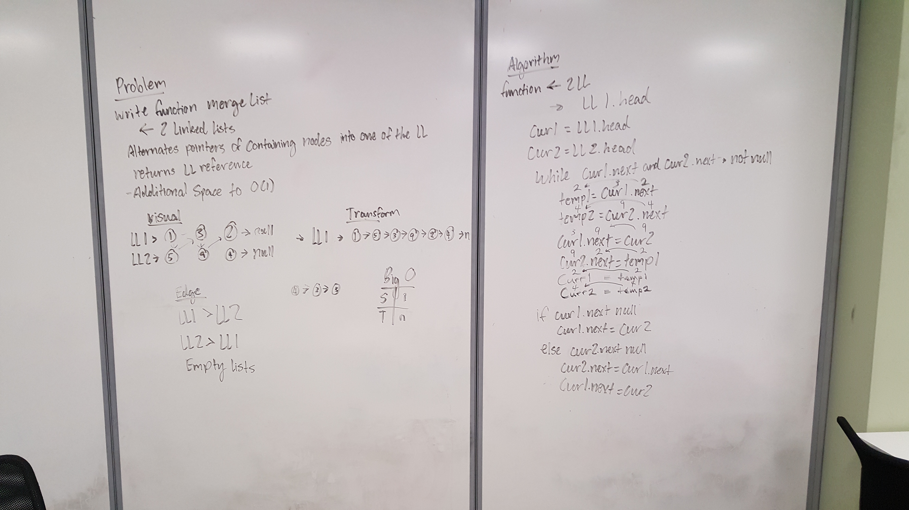

# Merge two Linked Lists
Function that combines two LL

## Travis

## Challenge
Merge a linked list with another linked list
return the reference to the LL

## Approach & Efficiency
Have a while loop that links LL1 nodes to LL2 nodes and LL2 nodes to the next node in LL1 until one LL is at the end. If one list is longer than the other, assigns the last node to the rest of whichever linked list still has nodes.

## Solution

