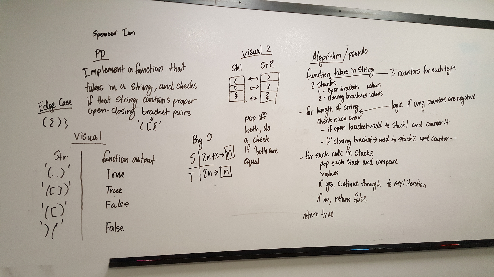

# Multi-bracket Validation.
Checks if there are proper bracket pairs in a string

## Travis

## Challenge
Implement a multi bracket validator that uses stacks and queues

## Approach & Efficiency
We have counters that really on keep track for the closing bracket first issue
We have a stack and a queue, the stack keeps track of opening braces, the queue tracks closing. We pop the stack and dequeue the queue and check if the values are the appropriate pair. If not, return false

## Note on the UML
This works, if the second 'stack' is actually a queue. The lines don't go straight across to each other. They point diagonally

## Solution
