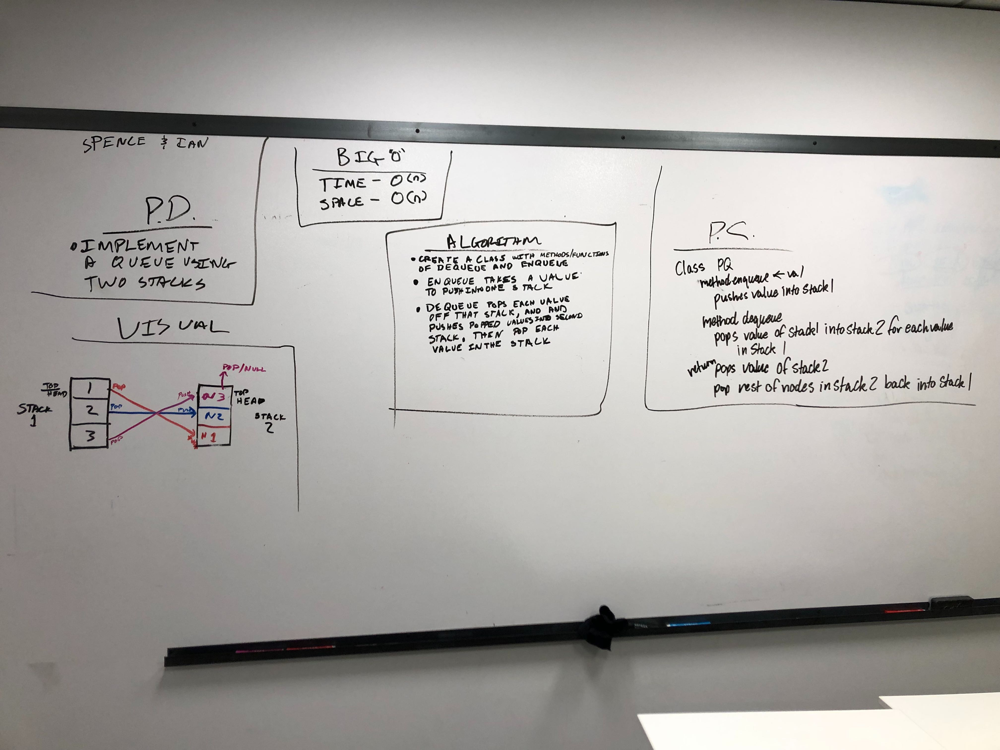

# Pseudo Queue
## Travis

## Challenge
Use 2 stacks to mimic the behavior of a queue

## Approach & Efficiency
##### Enqueue(value)
Our pseudo queue will go to stack one, which will push enqueue values
##### Dequeue()
pseudo queue will pop all the values off stack1 until stack1 is empty into stack2, then only pop the top value and return that value later. stack2 nodes will get all get popped off to stack 1 again to maintain the order. Then that initial pop from stack2 will be returned to the user. 

## Solution

