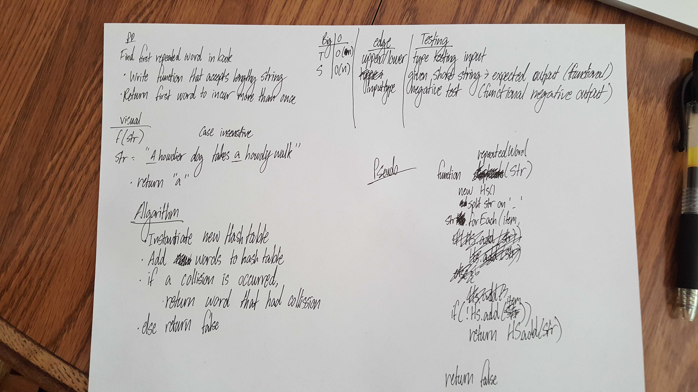

# First repeated word

## Challenge
Write a function that finds a duplicated word in a string

## Approach & Efficiency
* Add words to a hashmap
  * if the hashmap returns the value that it attempted to store, return that from the function
  * if the hashmap doesn't return anything, there's no duplicated word

## Solution

